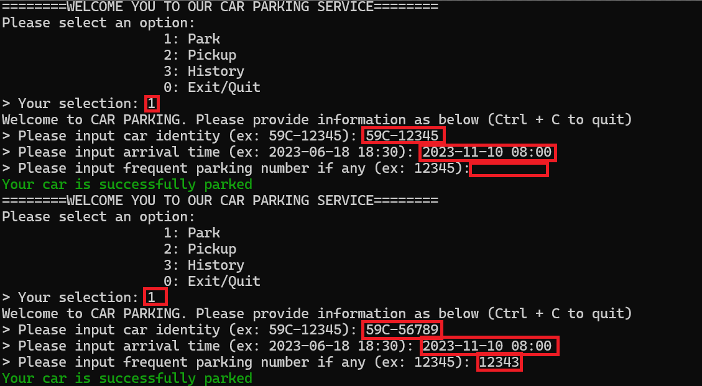
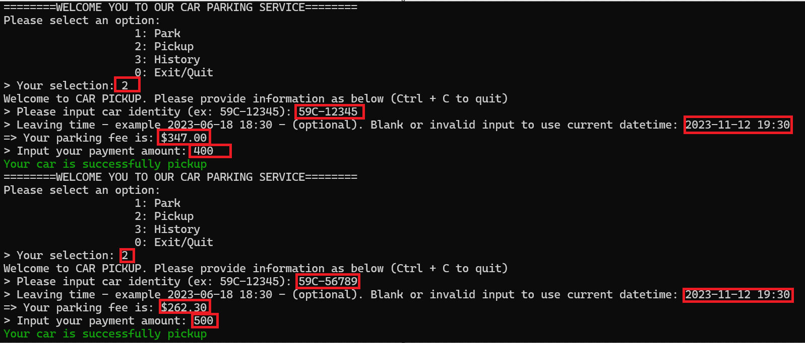
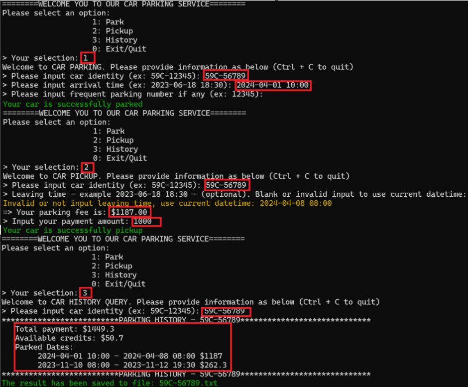

# Car Parking System
This is a simple car parking service implemented in Python (with sqlite) for practical/learning purpose. It allows users to park their cars, pick them up, and view their parking history along with the associated fees.

## Features

- Park a car
- Pick up a car
- View parking history

## How to Use

1. Clone this repository to your local machine.
2. Install the required dependencies by running:
   ```bash
   pip install -r requirements.txt
3. Run the app:
   ```bash
   python main.py
4. Follow the on-screen instructions to select an option:
    ```bash
    1: Park a car
    2: Pick up a car
    3: View parking history
    0: Exit/Quit
## Usage Examples
### Parking a Car
When selecting option <b>1</b>, you will be prompted to input the car's identity, arrival time, and frequent parking number (if any). Once entered, the car will be parked, and you will receive a confirmation message.

### Picking Up a Car
Option <b>2</b> allows you to pick up a parked car. You will need to input the car's identity. The service will calculate the parking fee based on the parked duration and display it. You'll be prompted to enter the payment amount, and if necessary, any available credit will be deducted. The payment history will be saved, and the car will be removed from the parking lot.

### Viewing Parking History
Selecting option <b>3</b> will prompt you to input the car's identity. The service will display the parking history for that car, including the total payment and available credits. Additionally, the history will be saved to a file for reference.


### Additional Information
- The parking fee calculation is based on the duration of parking and discounts applied during different time periods.
- Payment balances are maintained for each car to track available credits.
- Parking histories are stored and can be accessed later.
- The service handles exceptions gracefully and allows for smooth interaction with the user.